# Django_Ecommerce_Website
  
### Features and Updates:  
- Implemented creation Order and deleting Shopping-Cart elements after payment
- Implemented PayPal Payments for order
- Finished "Checkout page"  
- Implemented a User Profile(One-to-One Relationships). Additionally to info from build-in User module added to User Profile(inherit from built-in User module) address fields and phone field. Added fields to UpdateUser Page. Implemented  feature "pre-filled fields" to fields on WebPage "UpdateUser" if there are some info in database.  
- Added the ability to view pictures from the "Product Description" in full size (full screen). Also we can close picture by clicking on it.  
- Added the ability to change the quantity in product details and directly in the cart
- Added pagination. On a full page - max 20 products
- Implemented Product Search System 
- Registration and Login system
- Implemented multi-categories system. We can add as many categories as we want and system will add it to Categories section (in nav bar) automatically  
- Implemented Cart system. Each user have a different cart. Information is saved in a database
  
## How it looks like now  
  
### Home page  
  
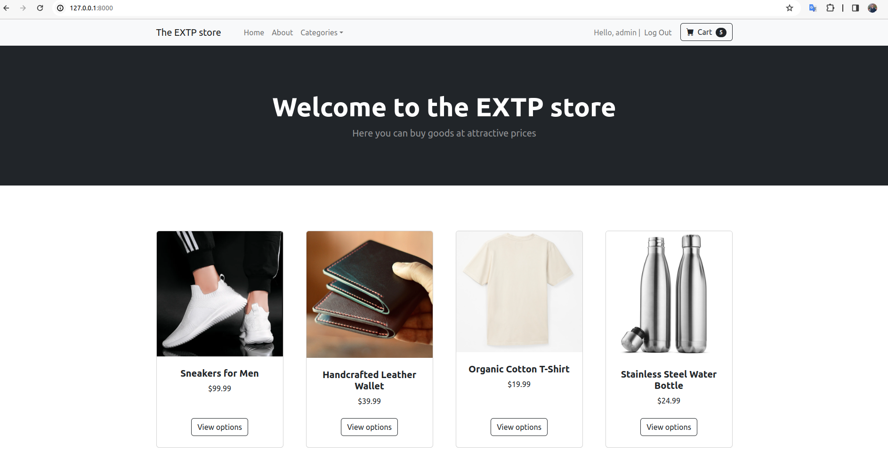  
  
### Other products (also implemented paginator)  
  
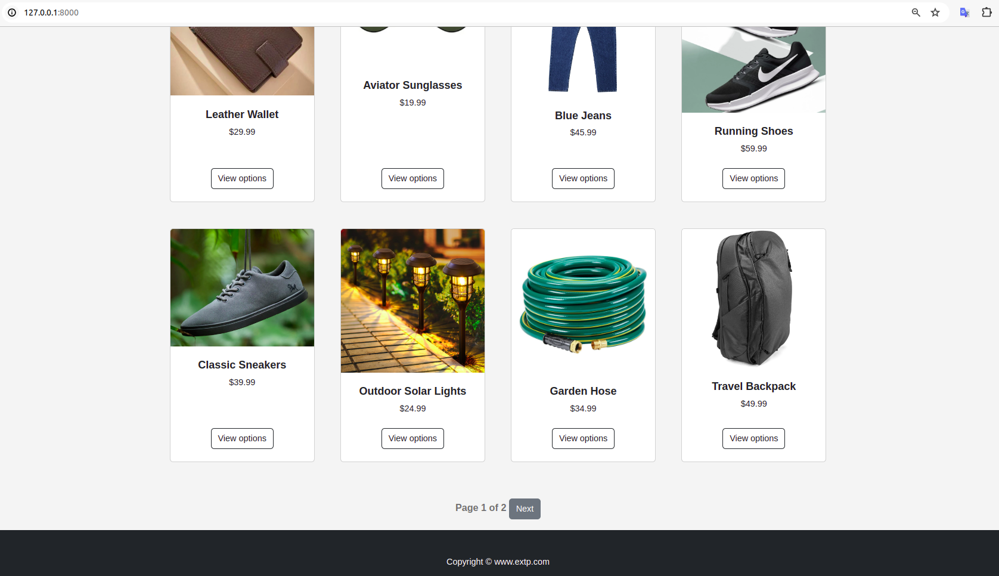  
  
### Sort products (Implemented search system)  
  
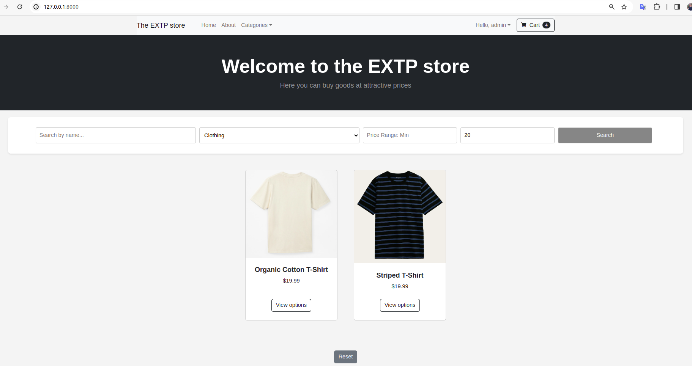  
  
### Sort by category(old Feature, implemented before implementing search system)  
  
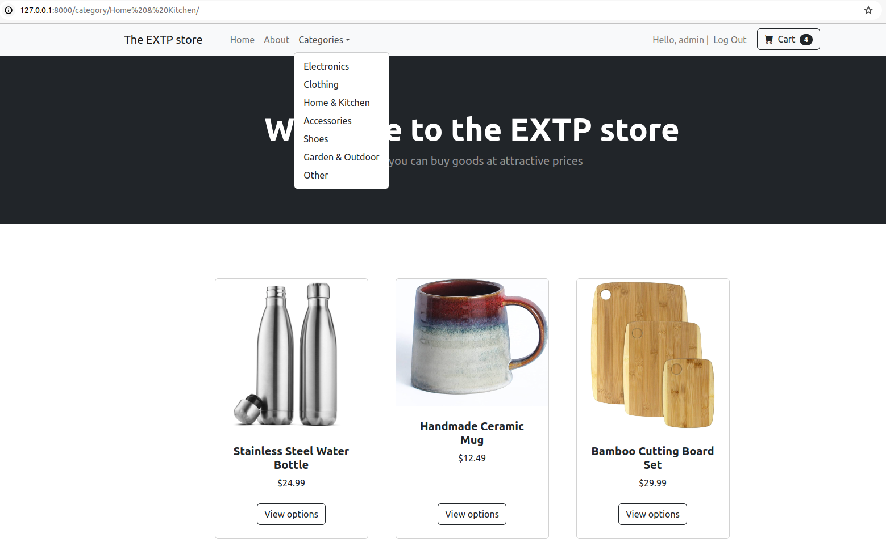  
  
  ### Product details
  
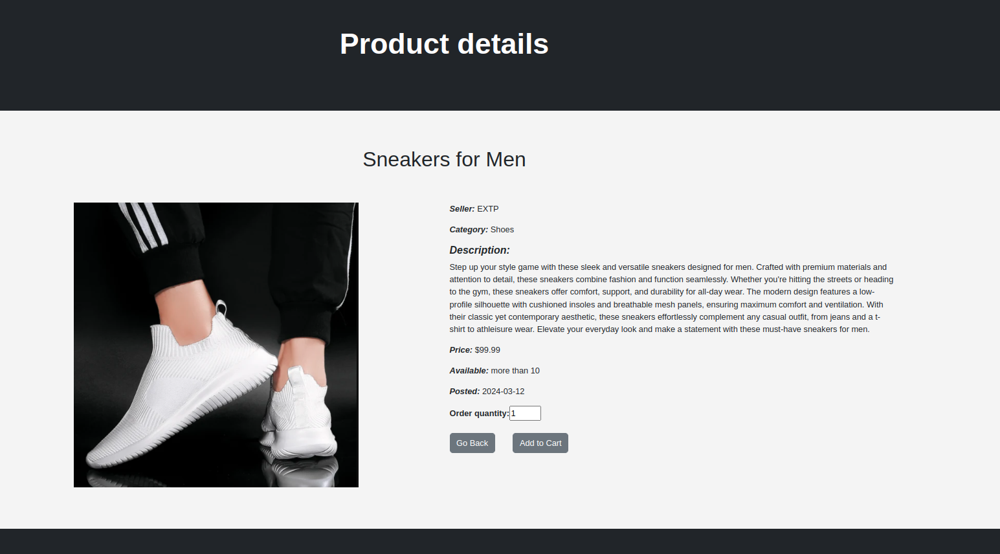  
  
### View the picture in fill size  
  
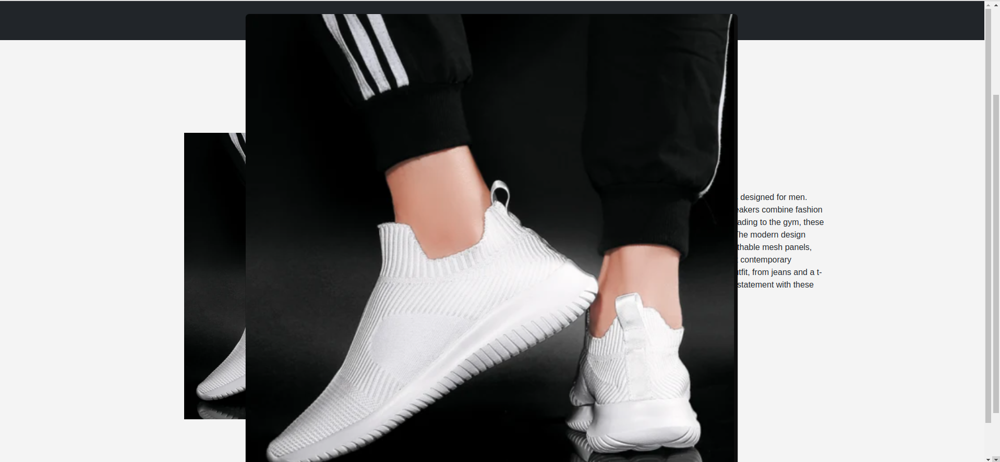    
  
### Shopping Cart(for every user different shipping cart)  
  
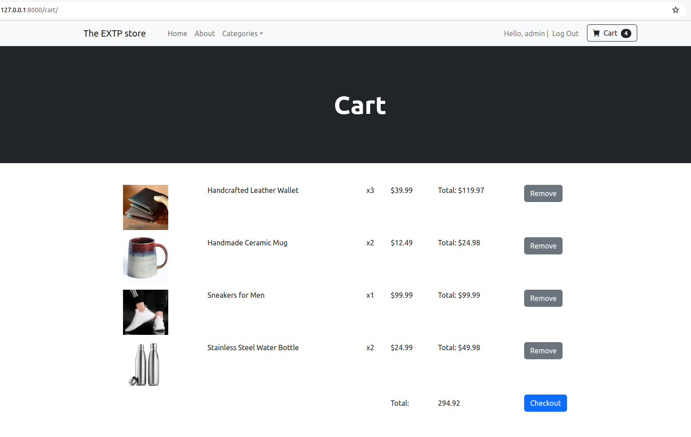    
  
### Checkout Page (part 1)
  
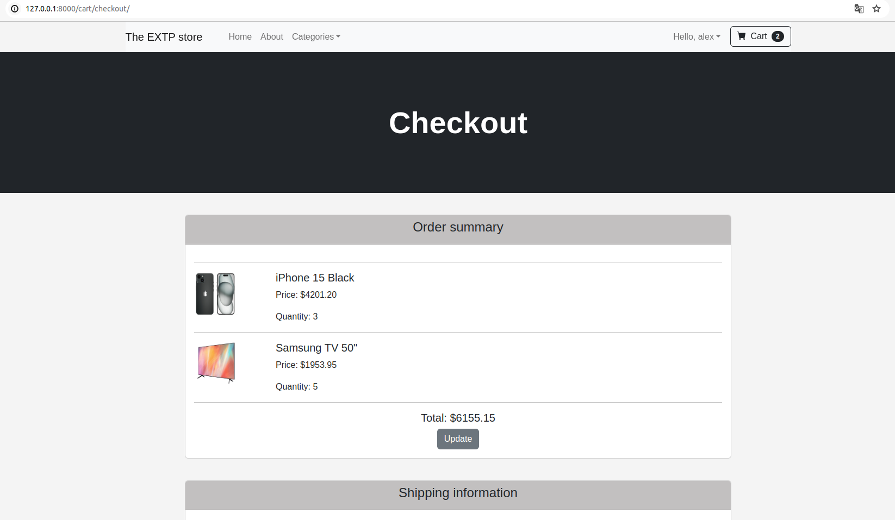   
  
### Checkout Page (part 2)
  
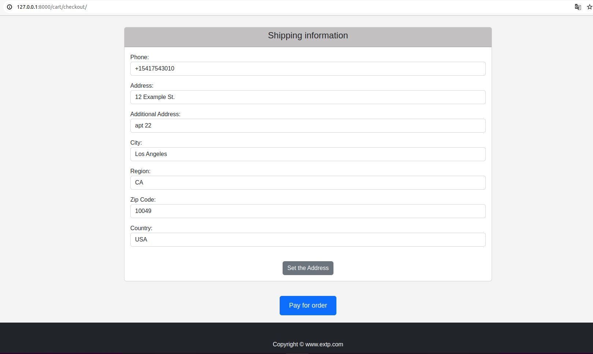   
  
### Checkout Page (part 3)
  
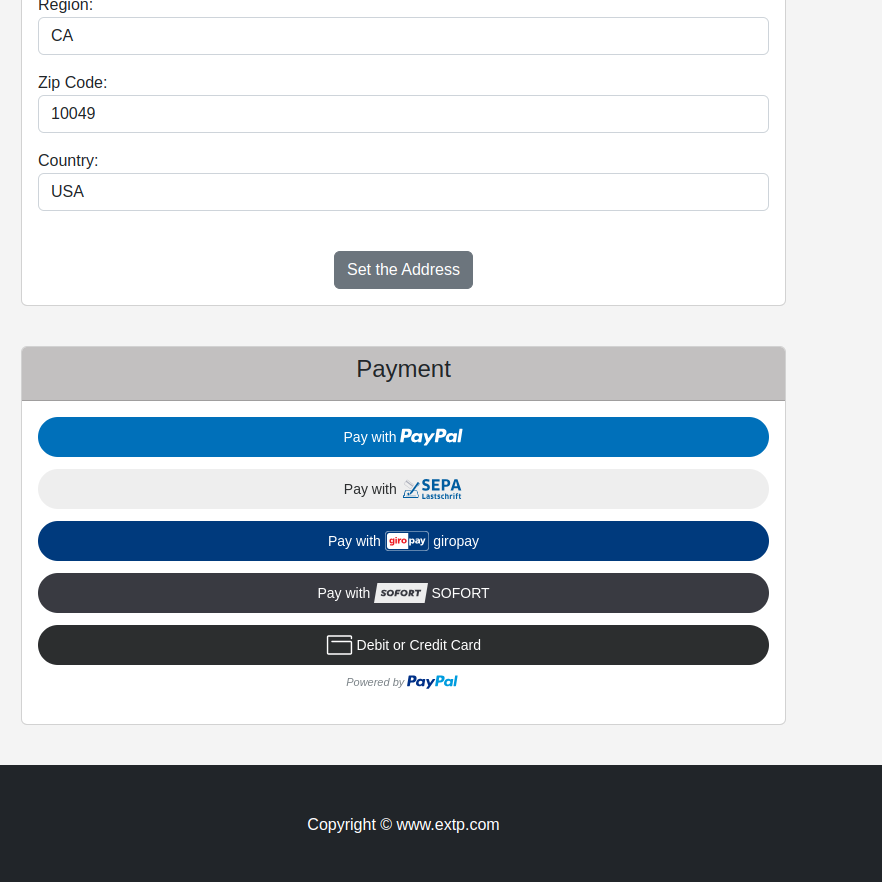   
  
### After clicking button "Pay with PayPal"
  
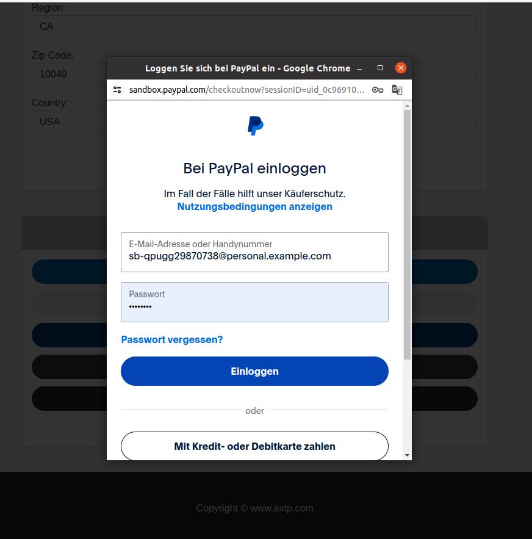   
  
### After Login in PayPal (implemented paypal sandbox - dummy payments)
  
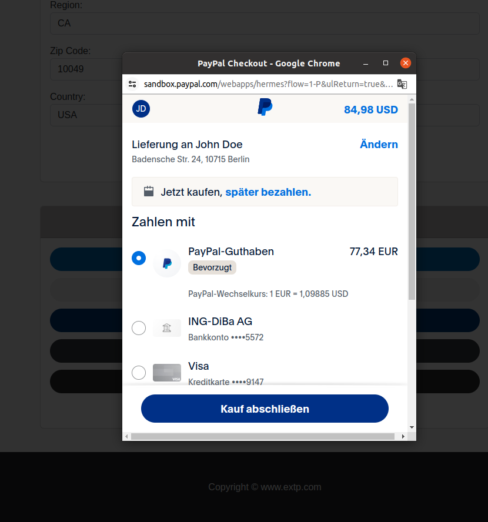   
  
### "Order completed" page after successful payment
  
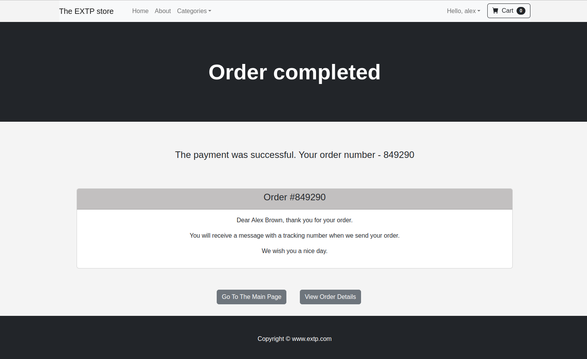   
  
## Login System
    
### Sign Up  
  
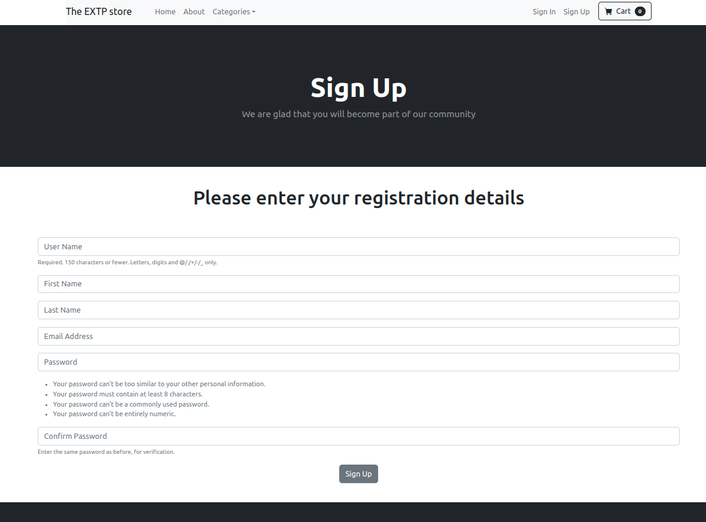  
  
### Sign In  
  
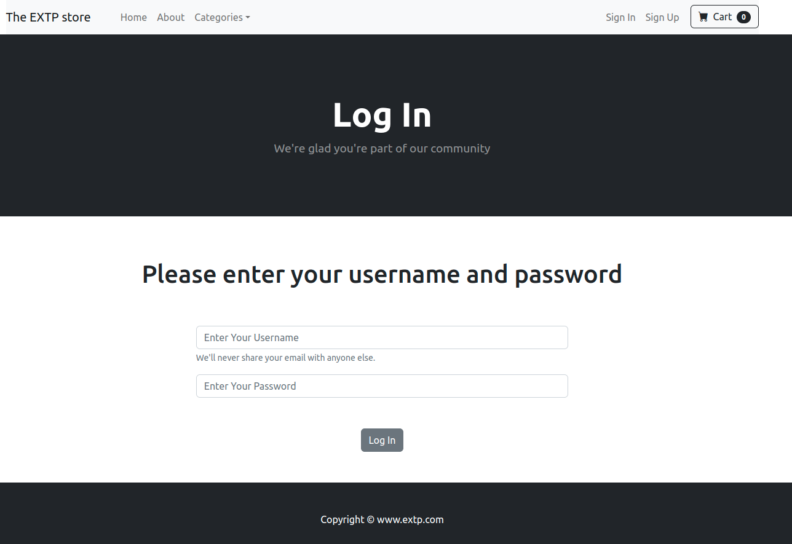  
  
  ### Logged in
  
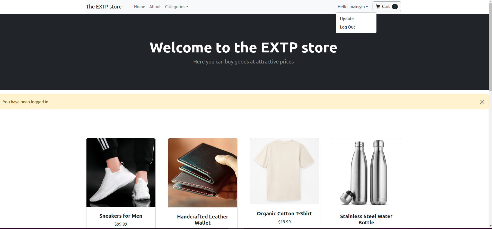  
  
### Update profile  
(Implemented a user profile inherited from the built-in user module)  
  
    
  
  

### Project is still in progress (the basic part has been built. 90% done)    
  
Template from - https://startbootstrap.com/template/shop-homepage  
